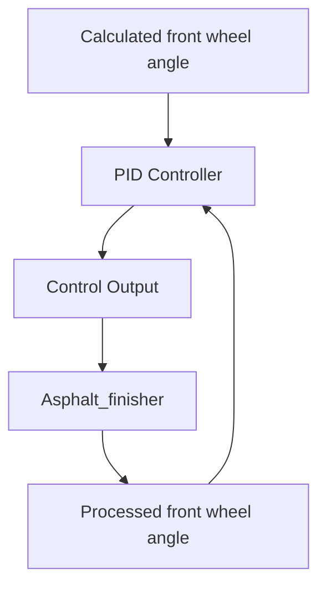

# Working of PID controller 
---
A PID controller is a feedback control mechanism used to control a system. It works by calculating an error value as the difference between the desired set-point and the actual process variable and adjusts the system output accordingly.
##  **Key Components of PID**

### 1. Proportional Term ($K_p$)
- **Function**: Immediate response to current error
- **Effect**:
  - ↑ $K_p$ → Faster response but risk of overshoot
  - ↓ $K_p$ → Slower response but more stability
- **Equation**:  
  $P_{out}=K_p*(set\_point-processing\_value)$

### 2. Integral Term ($K_i$)
- **Function**: Eliminates steady-state error
- **Effect**:
  - ↑ $K_i$ → Faster residual error elimination
  - ↑ $K_i$ → Increased oscillation risk
- **Equation**:  
  $I_{out}=K_i*(set\_point-processing\_value)*\Delta t$

### 3. Derivative Term ($K_d$)
- **Function**: Predicts future error trends
- **Effect**:
  - ↑ $K_d$ → Better damping of oscillations
  - ↑ $K_d$→ Increased noise sensitivity
- **Equation**:  
	$error_{current}=set\_point-processing\_value$
	$error_{previous} =error_{current}$
  $D_{out} = K_a*(error_{previous} - error_{current})/\Delta t$

**Total Control Output**:  
$Output = P_{out} + I_{out} + D_{out}$

![[Pasted image 20250508144620.png]]

**set point = desired value**
```python
class PIDController:  
	def __init__(self, Kp, Ki, Kd, setpoint):  
		self.Kp = Kp  
		self.Ki = Ki  
		self.Kd = Kd  
		self.setpoint = setpoint  
		self.previous_error = 0  
		self.integral = 0  
  
def compute(self, process_variable, dt):  
	# Calculate error  
	error = self.setpoint - process_variable  
	  
	# Proportional term  
	P_out = self.Kp * error  
	  
	# Integral term  
	self.integral += error * dt  
	I_out = self.Ki * self.integral  
	  
	# Derivative term  
	derivative = (error - self.previous_error) / dt  
	D_out = self.Kd * derivative  
	  
	# Compute total output  
	output = P_out + I_out + D_out  
	  
	# Update previous error  
	self.previous_error = error  
	  
	return output
```
## Implementation Notes
## Parameter Tuning Recommendations
1. Start with $K_p$  only (set $K_i$ =0, $K_d$ =0).
2. Increase $K_p$  until sustained oscillations occur.
3. Set $K_p$  to 50% of oscillation value.
4. Introduce $K_i$  for steady-state error correction.
5. Add $K_d$  to dampen oscillations.
### Key Features
- **Anti-Windup Protection**: Optional clamp on integral term.
- **Derivative Filtering**: Low-pass filter for noise reduction.
- **Bumpless Transfer**: Smooth parameter changes during operation.
### Tuning Guide
| Method               | Advantages                  | Limitations               |
|----------------------|-----------------------------|---------------------------|
| Ziegler-Nichols      | Systematic approach         | Aggressive tuning         |
| Cohen-Coon           | Good for slow processes     | Complex calculations      |
| Software Auto-Tuning | Automated optimization      | Requires special equipment|
> **Note**: Always validate PID parameters in a controlled environment before deployment to real systems. Consider implementing safety limits and manual override capabilities. Real-world PID coefficient and Simulation coefficient is too different.