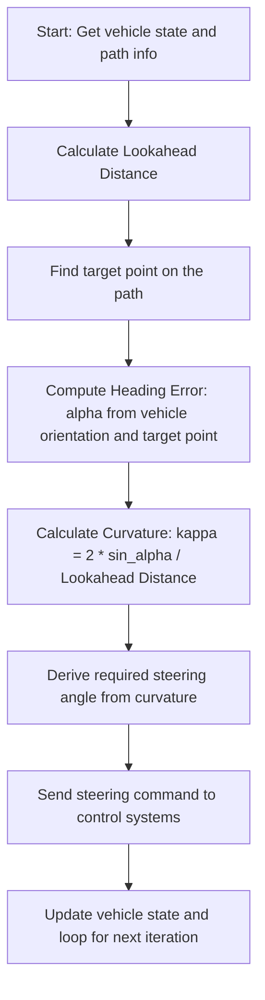

## Algorithm

We want to control the front wheel angle $\delta$, such that the vehicle follows a given path. This is known as **lateral vehicle control**.
In the pure pursuit method a target point `(TP)` on the desired path is identified, which is a **look-ahead distance** $l_d$ away from the vehicle. The angle $\delta$ is chosen such that the vehicle will reach the target point according to the kinematic bicycle model. 
![[Pasted image 20250514144725.png]]
The look-ahead distance is a parameter, and is typically chosen to depend on the speed $v$ via $l_d = K_{dd} v$, where the constant $K_{dd}$ needs to be tuned. We can also enforce a minimal and maximal look-ahead distance, so as to avoid undesirable behavior at very high and very low speeds. 
$$L_{d}= k\times v  +L_{min}​$$
- **$v$**  = Current vehicle speed (m/s).
- $k$ = Tuning gain (s) to scale $L_d$​ with speed.
- $L_{ming}$​ = Minimum look-ahead distance (m) to ensure stability at low speeds.

Let us draw the bicycle model and a given path we should follow. We also draw a circle of radius $l_d$ around the center of the rear wheel. The intersection of this circle with the path is our target point **TP**. According to the kinematic bicycle model, the vehicle will move along the orange arc, which is determined by the front wheel angle $\delta$. We want to choose $\delta$, such that the orange vehicle trajectory will move to the target point.
![[Pasted image 20250514140459.png]]
`Bicycle model should follow a path. With the current front wheel angle $\delta$, it will not reach the target point TP.`
`

We will see how change the value of $\delta$ until the vehicle trajectory goes through the target point:
- [ ] $\delta$ = 25 $\degree$
![[Pasted image 20250514174548.png]]
- [ ] $\delta$ = 20 $\degree$
![[Pasted image 20250514174654.png]]
- [ ] $\delta$ = 15 $\degree$
![[Pasted image 20250514174704.png]]
- [ ] $\delta$ = 11.3 $\degree$
![[Pasted image 20250514174711.png]]

But there is a more elegant solution than just trying out a bunch of different $\delta$ values. We can actually compute the optimal $\delta$ based on the magenta triangle in the sketch below
![[Pasted image 20250514142018.png]]

First, we note that the distance from the instantaneous center of rotation (ICR) to the target point (TP) is equal to $R$, since TP lies on the orange circle of radius $R$ around ICR. Hence, the magenta triangle is [isosceles](https://en.wikipedia.org/wiki/Isosceles_triangle) and $\gamma_2=\gamma_3$. From the figure we can see that $\gamma_3+\alpha=90°$. Hence $\gamma_2=\gamma_3=90°-\alpha$. Since the sum of all angles in a triangle equals $180°$, we have 

$$180°=\gamma_1+\gamma_2+\gamma_3 = \gamma_1 + (90°-\alpha) + (90°-\alpha)$$

which yields $\gamma_1=2\alpha$. According to the [law of sines](https://en.wikipedia.org/wiki/Law_of_sines)

$$ \frac{l_d}{\sin(\gamma_1)} = \frac{R}{\sin(\gamma_2)} $$

Here, we used that the distance between the rear wheel and the target point TP is $l_d$. If we substitute $\gamma_1=2\alpha$ and $\gamma_2=90°-\alpha$ into the above formula, we obtain

$$ \frac{l_d}{\sin(2 \alpha)} = \frac{R}{\sin(90° - \alpha)} $$

Due to the [trigonometric addition formulas](https://mathworld.wolfram.com/TrigonometricAdditionFormulas.html), we have $\sin(90° - \alpha) = \cos(\alpha)$ and $\sin(2\alpha)=\sin(\alpha+\alpha)=2\sin(\alpha) \cos(\alpha)$. Hence, we can further simplify the formula above to find

$$ \frac{l_d}{2\sin(\alpha) \cos(\alpha)} = \frac{R}{\cos(\alpha)} $$

which yields $R=l_d/(2 \sin(\alpha))$. For the kinematic bicycle model we have previously derived a formula for the wheel angle $\delta$ as a function of $R$. It was $\delta = \arctan(L/R)$, where $L$ is the wheel base, i.e., the distance between the wheels. Combining this with the newly found formula for $R$ we finally obtain

$$ \delta = \arctan \left(\frac{2 L \sin(\alpha)}{l_d}\right) $$
This is the angle $\delta$ we need to pick to reach the target point! We can write down the pure pursuit algorithm now:

